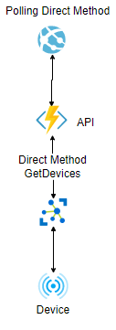

# Flask Direct app.
## About
Made for the Element14s Azure Sphere "Sensing The World" competition.
This is used along with the [Azure Sphere code](https://github.com/SrzStephen/azure-sphere-monitor-environment) for that competition.

it submoduled under the API folder. This flask app implements a web UI to implement a [direct method call](https://docs.microsoft.com/en-us/azure/iot-hub/iot-hub-devguide-direct-methods) to remotely change the polling time on the azure sphere without needing to update the Azure Sphere code.

This is slightly more complicated than I would like due to the current preview of the python IOT Hub V2 library being in pre-release and the old V1 version having some issues that make it hard to run on [Azures Application Service](https://github.com/Azure/azure-iot-sdk-python/issues/284). 

I have an additional C# Azure function that is used to create an API endpoint that this library uses to interact with the Azure IOT Hub.

## Environment Variables
You'll need the following environment variables
* AZURE_API_ENDPOINT=
* AZURE_API_HOST_KEY=

